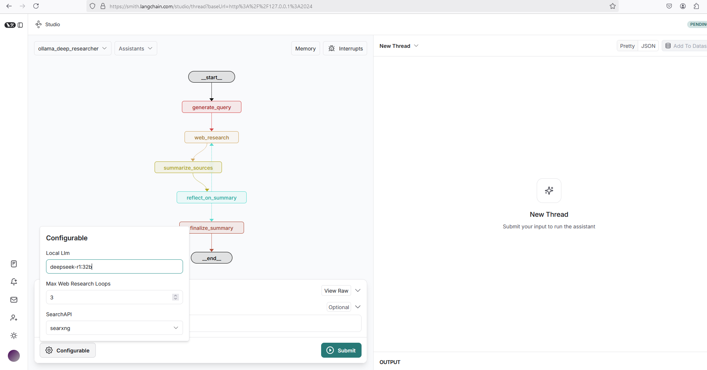

# Ollama Deep Researcher (SearxNG Fork)

> **Note**: This is a fork of the original [Ollama Deep Researcher](https://github.com/langchain-ai/ollama-deep-researcher) by LangChain. Special thanks to the LangChain team for their excellent work on the original project.
>
> **Key Modifications**:
> - Replaced Tavily API with SearxNG integration for fully local and private web searching
> - Eliminated API costs by using self-hosted search infrastructure
> - Enhanced privacy by keeping all operations local

---

Ollama Deep Researcher is a fully local web research assistant that uses any LLM hosted by Ollama. Give it a topic and it will generate a web search query, gather web search results (via local SearxNG instance), summarize the results of web search, reflect on the summary to examine knowledge gaps, generate a new search query to address the gaps, search, and improve the summary for a user-defined number of cycles. It will provide the user a final markdown summary with all sources used.




Short summary:
<video src="https://github.com/user-attachments/assets/02084902-f067-4658-9683-ff312cab7944" controls></video>

## 📺 Video Tutorials

See it in action or build it yourself? Check out these helpful video tutorials:
- [Overview of Ollama Deep Researcher with R1](https://www.youtube.com/watch?v=sGUjmyfof4Q) - Load and test [DeepSeek R1](https://api-docs.deepseek.com/news/news250120) [distilled models](https://ollama.com/library/deepseek-r1).
- [Building Ollama Deep Researcher from Scratch](https://www.youtube.com/watch?v=XGuTzHoqlj8) - Overview of how this is built.

## 🚀 Quickstart

### Mac 

1. Download the Ollama app for Mac [here](https://ollama.com/download).

2. Pull a local LLM from [Ollama](https://ollama.com/search). As an [example](https://ollama.com/library/deepseek-r1:8b): 
```bash
ollama pull deepseek-r1:8b
```

3. Select a web search tool:

* [Tavily API](https://tavily.com/)
* [Perplexity API](https://www.perplexity.ai/hub/blog/introducing-the-sonar-pro-api)

Set the corresponding environment variable and restart your terminal to ensure it is set:

```bash
export TAVILY_API_KEY=<your_tavily_api_key>
export PERPLEXITY_API_KEY=<your_perplexity_api_key>
```

4. (Recommended) Create a virtual environment:
```bash
python -m venv .venv
source .venv/bin/activate
```

5. Clone the repository and launch the assistant with the LangGraph server:

```bash
# Install uv package manager
curl -LsSf https://astral.sh/uv/install.sh | sh

# Clone the repository and start the LangGraph server 
git clone https://github.com/langchain-ai/ollama-deep-researcher.git
cd ollama-deep-researcher
uvx --refresh --from "langgraph-cli[inmem]" --with-editable . --python 3.11 langgraph dev
```

### Windows 

1. Download the Ollama app for Windows [here](https://ollama.com/download).

2. Pull a local LLM from [Ollama](https://ollama.com/search). As an [example](https://ollama.com/library/deepseek-r1:8b): 
```powershell
ollama pull deepseek-r1:8b
```

3. Select a web search tool:

* [Tavily API](https://tavily.com/)
* [Perplexity API](https://www.perplexity.ai/hub/blog/introducing-the-sonar-pro-api)

Set the corresponding environment variable in Windows (via System Properties or PowerShell). Crucially, restart your terminal/IDE (or sometimes even your computer) after setting it for the change to take effect:

```bash
export TAVILY_API_KEY=<your_tavily_api_key>
export PERPLEXITY_API_KEY=<your_perplexity_api_key>
```

4. (Recommended) Create a virtual environment: Install `Python 3.11` (and add to PATH during installation). Restart your terminal to ensure Python is available, then create and activate a virtual environment:

```powershell
python -m venv .venv
.venv\Scripts\Activate.ps1
```

5. Clone the repository and launch the assistant with the LangGraph server:

```powershell
# Clone the repository 
git clone https://github.com/langchain-ai/ollama-deep-researcher.git
cd ollama-deep-researcher

# Install dependencies 
pip install -e .
pip install langgraph-cli[inmem]

# Start the LangGraph server
langgraph dev
```

### Using the LangGraph Studio UI 

When you launch LangGraph server, you should see the following output and Studio will open in your browser:
> Ready!
> 
> API: http://127.0.0.1:2024
> 
> Docs: http://127.0.0.1:2024/docs
> 
> LangGraph Studio Web UI: https://smith.langchain.com/studio/?baseUrl=http://127.0.0.1:2024

Open `LangGraph Studio Web UI` via the URL in the output above. 

In the `configuration` tab:
* Pick your web search tool (Tavily or Perplexity) (it will by default be `Tavily`) 
* Set the name of your local LLM to use with Ollama (it will by default be `llama3.2`) 
* You can set the depth of the research iterations (it will by default be `3`)


Give the assistant a topic for research, and you can visualize its process!


## How it works

Ollama Deep Researcher is inspired by [IterDRAG](https://arxiv.org/html/2410.04343v1#:~:text=To%20tackle%20this%20issue%2C%20we,used%20to%20generate%20intermediate%20answers.). This approach will decompose a query into sub-queries, retrieve documents for each one, answer the sub-query, and then build on the answer by retrieving docs for the second sub-query. Here, we do similar:
- Given a user-provided topic, use a local LLM (via [Ollama](https://ollama.com/search)) to generate a web search query
- Uses a search engine (configured for [Tavily](https://www.tavily.com/)) to find relevant sources
- Uses LLM to summarize the findings from web search related to the user-provided research topic
- Then, it uses the LLM to reflect on the summary, identifying knowledge gaps
- It generates a new search query to address the knowledge gaps
- The process repeats, with the summary being iteratively updated with new information from web search
- It will repeat down the research rabbit hole 
- Runs for a configurable number of iterations (see `configuration` tab)  

## Outputs

The output of the graph is a markdown file containing the research summary, with citations to the sources used.

All sources gathered during research are saved to the graph state. 

You can visualize them in the graph state, which is visible in LangGraph Studio:


The final summary is saved to the graph state as well: 


## Deployment Options

There are [various ways](https://langchain-ai.github.io/langgraph/concepts/#deployment-options) to deploy this graph.

See [Module 6](https://github.com/langchain-ai/langchain-academy/tree/main/module-6) of LangChain Academy for a detailed walkthrough of deployment options with LangGraph.
